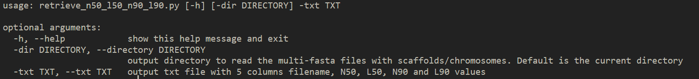
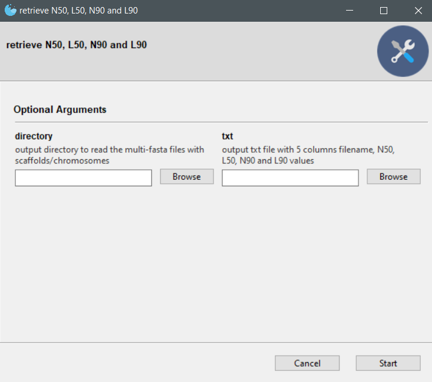

# retrieve_n50_l50_n90_l90 
command line and GUI scripts that retrieve the N50, L50, N90 and L90 values by indexing input multi-fasta files

Based by: [n50.py](https://gist.github.com/dinovski/2bcdcc770d5388c6fcc8a656e5dbe53c)

## Executables(no dependences required)
1. linux command line executable:   
2. Windows and linux GUI executable: 

## Dependences
1. python 3.8.3 or later
2. argparse (for the command line script only) `pip install argparse`
3. pyfaidx `pip install pyfaidx`
4. numpy `pip install numpy`
5. miniconda3 (for the GUI script only)
6. Gooey (for the GUI script only) `conda install -c conda-forge gooey`  

To run the command line version of the script you need to give at least 1 of the following arguments:  

e.g. `python3 retrieve_n50_l50_n90_l90.py -dir fastadir/ -txt stats.txt`

To run the GUI version you need to type: `python3 retrieve_n50_l50_n90_l90_gui.py` on the terminal and a window will pop up

